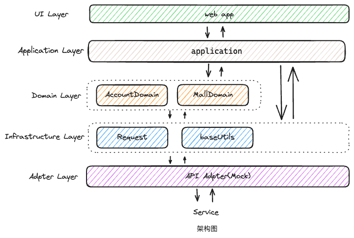

## 前端架构设计

DDD分层架构，强调的是规范。

先花些时间梳理业务，再考虑建模，领域划分，实体创建等。把代码放在合适的位置，做到业务逻辑高内聚、低耦合。前期花多点时间考虑清楚，后面写起来才会有优质体验。

* UI Layer: 用户界面。
* Application Layer: 应用层。在这里组织业务逻辑，调用领域提供的交互行为。
* Domain Layer: 领域层，核心业务的抽象封装。领域之间可以相互调用，领域也能向外层提供服务。
* Infrastructure Layer: 基础层。内部工具库，向外层提供API。可独立发包。
* Adapter Layer(Mock): 接口层。这里暂时只用Mock。（考虑是否不需要这一层，集成至Domain里）